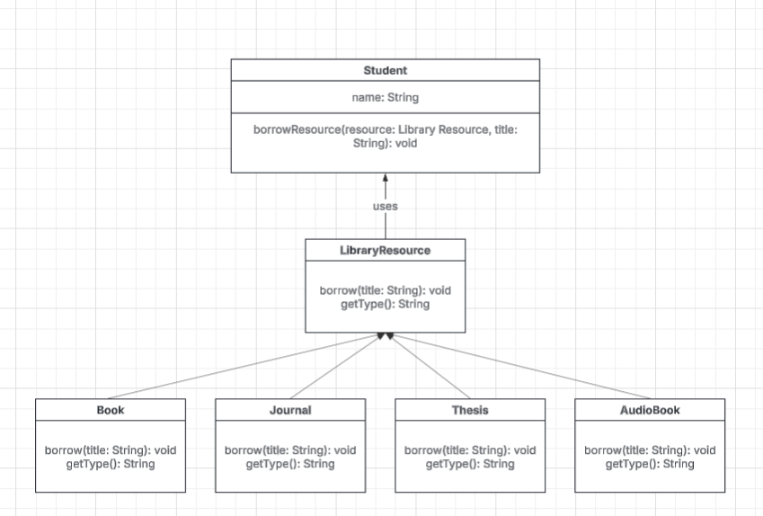

# SOLID-Principles_NEU-Library-System

📝 Problem Statement

The NEU Library system currently allows students to borrow resources such as books and journals using methods like:

- borrowBook()
- borrowJournal()

This design tightly couples the Student class to specific resource types, violating the Dependency Inversion Principle (DIP).

The goal is to refactor the system to:

- Follow SOLID principles
- Allow easy addition of new resource types (e.g., AudioBook, E-Journal)
- Improve flexibility and maintainability

UML Class Diagram:
